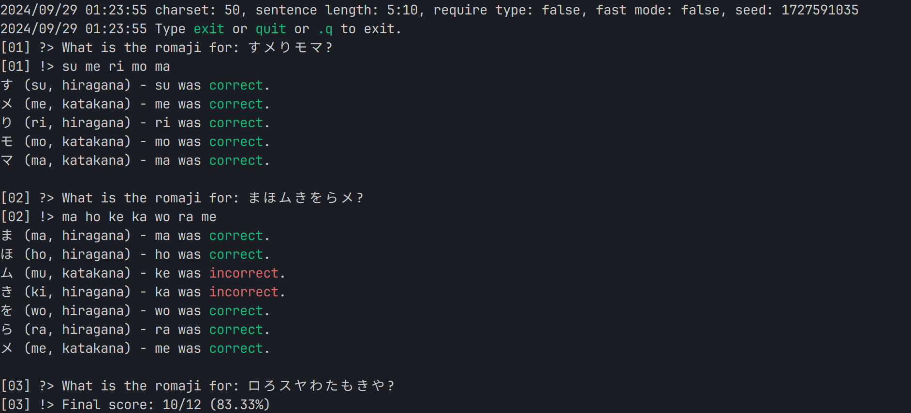

# katest

Release of my personal kana trainer tool, written in Go. Per request of a Fediverse user.

A trainer for kana recognition by generating random character sequences and asking the user to type them in.




## Personal Notes

When I learned Japanese, I found the fastest way for me is first use a flashcard tool to get mostly comfortable, then use this trainer, gradually increasing the set of characters and get to a point where I can read kana fast.

## Usage

```bash
  -acc
        enable accuracy mode, show statistics after each round
  -charset string
        charset to use, a comma-separated list of characters. (default "50")
  -fast
        fast mode, do not require split by space, only use this when your error rate is low and want better speed
  -length string
        sentence length (default "5:10")
  -seed int
        seed for random number generator (default 1727590108)
  -type
        require :h/:k notation when inputting romaji for testing hiragana/katakana classification
```

Charset: "50" is the default commonly used 50 kana characters, "all" is all kana characters, "hiragana" is only hiragana, "katakana" is only katakana. Individual characters can be specified as well and joined by "+", for example "-charset ka+ki+ku+ke+ko" will only use these 5 characters.

Length: "5:10" is the default sentence length range, from 5 to 10 characters. You can also specify a single number to use a fixed length.

Type: When enabled, answers need to be suffixed with ":h" or ":k" to indicate hiragana or katakana respectively.

Fast: When enabled, the program will not require you to split the input by space, and instead it will assume the input is the correct length and split it automatically. Only use this when you are confident in your accuracy and want a "typing" experience.

